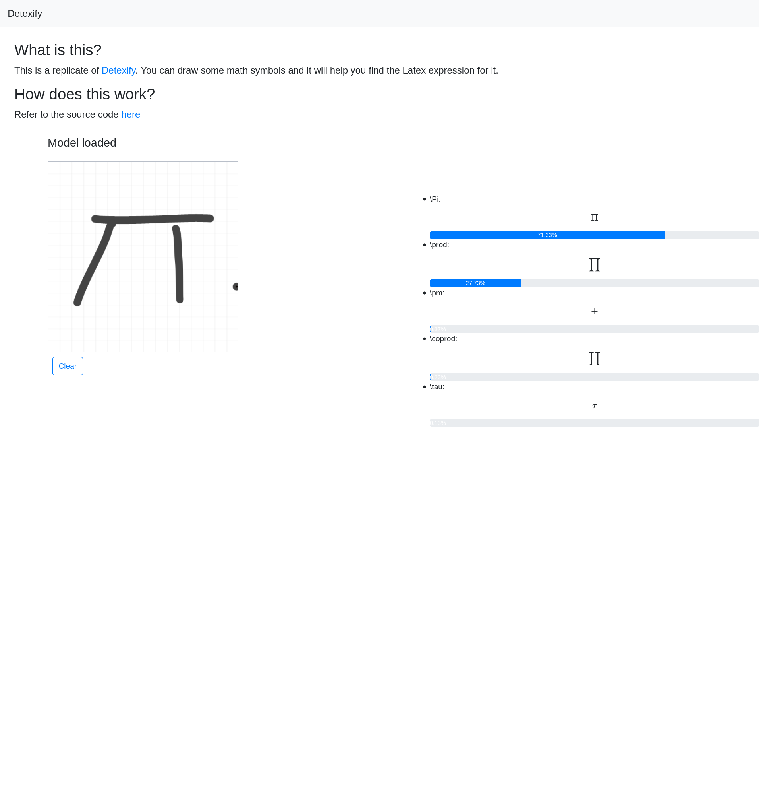

# Detexify replicate

This app replicates the functionalities of [Detexify](https://detexify.kirelabs.org/classify.html).

Demo link: detexify.yuhuishi.me

[](https://cloud.digitalocean.com/apps/new?repo=https://github.com/Yuhuishishishi/detexify-replicate/tree/main)

## What it can do 

>  Anyone who works with LaTeX knows how time-consuming it can be to find a symbol in symbols-a4.pdf that you just can't memorize. Detexify is an attempt to simplify this search. 

## How do I use it?

>  Just draw the symbol you are looking for into the square area above and look what happens! 



## How is the model trained?

The model is trained using the [Kaggle notebook](https://www.kaggle.com/dayeye2006/cnn-image-classification-hasyv2).
Under the hood, the model is a simple CNN learner. 

The data the model is trained on consist of bunch of labeled math symbol images. You can find more details here [HASYv2 Dataset](https://www.kaggle.com/martinthoma/hasyv2-dataset-friend-of-mnist).

Overall, the model can achieve 60% accuracy.

## How is the model served?

The model is served through [tensorflow.js](https://www.tensorflow.org/js), and runs in your browser. There is no backend associated with the application. 

To deploy the model, we need to convert it to the json format using
```
 tensorflowjs_converter --input_format keras maths_model.h5 ./full
```
where `maths_model.h5` is the model generated by the notebook.
Then put the artifacts under `public/models`.